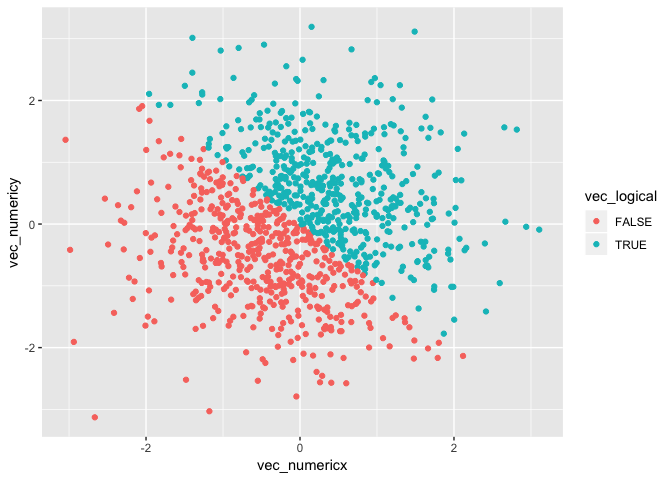
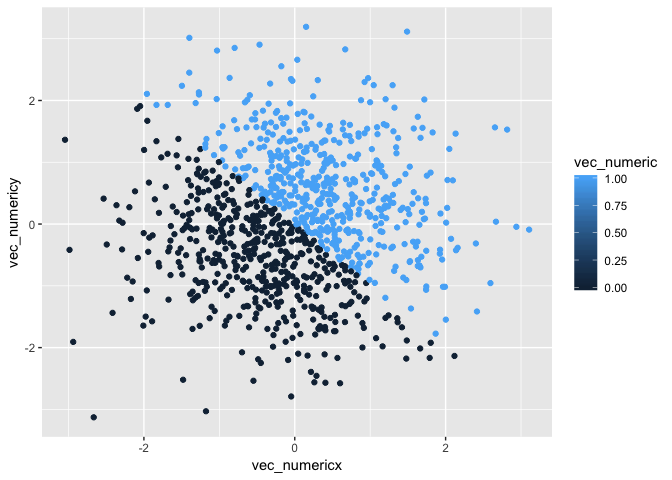

Homework 1
================
Eileen Shea
September 21, 2018

## Problem 1

Here are two chunks of code that create the described data frame:

``` r
set.seed(123)
x = runif(10, min = 0, max = 5)
```

``` r
hw1_prob1_df = tibble(
  vec_numeric = x,
  vec_logical = c(FALSE, TRUE, TRUE, TRUE, TRUE, FALSE, TRUE, TRUE, TRUE, TRUE),
  vec_char = c("You", "miss", "one-hundred", "percent", "of", "the", "shots", "you", "don't", "take"),
  vec_factor = factor(c("yes", "no", "no", "yes", "no", "yes", "yes", "no", "no", "yes"))
)
```

Next is a code chunk that tries to take the mean of the variables in the
data
    frame:

``` r
mean(hw1_prob1_df$vec_numeric)
```

    ## [1] 2.891238

``` r
mean(hw1_prob1_df$vec_logical)
```

    ## [1] 0.8

``` r
mean(hw1_prob1_df$vec_char)
```

    ## Warning in mean.default(hw1_prob1_df$vec_char): argument is not numeric or
    ## logical: returning NA

    ## [1] NA

``` r
mean(hw1_prob1_df$vec_factor)
```

    ## Warning in mean.default(hw1_prob1_df$vec_factor): argument is not numeric
    ## or logical: returning NA

    ## [1] NA

Taking the mean of **numeric** and **logical** variables *works*, while
taking the mean of character and factor variables does not. This is
because numeric and logical variables have a number assigned to them (in
the case of FALSE and TRUE this is 0 and 1 respectively), while
character and factor variables do not have assigned number values to
summarize through a statistic like the mean.

But we can try to convert variables from one type to another, as in the
below code chunk:

``` r
as.numeric(hw1_prob1_df$vec_logical)
as.numeric(hw1_prob1_df$vec_char)
as.numeric(hw1_prob1_df$vec_factor)
```

When we apply the as.numeric function to the logical variables they are
numerically represented by 0 (for FALSE) and 1 (for TRUE); when we apply
the as.numeric function to the factor variables they are then
numerically represented by 1 (no) and 2 (yes). However, the character
variables, even when the as.numeric function is applied, are all
assigned NA (not available, i.e. missing values).

Here is a second code chunk demonstrating conversion between variable
type:

``` r
as.numeric(as.factor(hw1_prob1_df$vec_char))
```

    ##  [1] 10  2  4  5  3  8  6  9  1  7

``` r
as.numeric(as.character(hw1_prob1_df$vec_factor))
```

    ## Warning: NAs introduced by coercion

    ##  [1] NA NA NA NA NA NA NA NA NA NA

When you convert a character variable to a factor variable and then a
numeric variable, each character element ultimately gets assigned a
unique number in the end. Alternatively, when you convert a factor
variable to a character variable and then a numeric variable, each
factor variable ultimately ends up being assigned an NA value.

## Problem 2

Below are the code chunks that create the data frame for Problem 2:

``` r
set.seed(12)
x = rnorm(1000)
y = rnorm(1000)
```

``` r
hw1_prob2_df = tibble(
  vec_numericx = x,
  vec_numericy = y,
  vec_logical = ifelse(x + y > 0, TRUE, FALSE),
  vec_numeric = as.numeric(vec_logical),
  vec_factor = as.factor(vec_logical)
)
```

It is next useful to describe our vector. The dataset is 1000 rows and 5
columns; the mean of our *x* variable is -0.0264365 while the median is
-0.0412079; the proportion of cases for which the logical vector is TRUE
is 0.503.

Lastly is the code that will create the described *y* vs. *x*
scatterplots.

Here is the first scatterplot that color points using the **logical**
variable:

``` r
ggplot(hw1_prob2_df, aes(x = vec_numericx, y = vec_numericy, color = vec_logical)) + geom_point()
```

<!-- -->

Here is the second scatterplot that color points using the **numeric**
variable:

``` r
ggplot(hw1_prob2_df, aes(x = vec_numericx, y = vec_numericy, color = vec_numeric)) + geom_point()
```

<!-- -->

Here is the third scatterplot that color points using the **factor**
variable:

``` r
ggplot(hw1_prob2_df, aes(x = vec_numericx, y = vec_numericy, color = vec_factor)) + geom_point()
```

<!-- -->

For both the scatterplots that use the logical variable and factor
variable as the color points, the color points are completely
dichotmized. Alternatively, for the scatterplot that uses the numeric
variable as the color points, there is a gradient color scale for the
color points (although only the 0 and 1 colors are ultimately used in
the plot).

As a final step, here is the first graph
exported:

``` r
ggsave("hw1_scatter.png", plot = ggplot(hw1_prob2_df, aes(x = vec_numericx, y = vec_numericy, color = vec_logical)) + geom_point() )
```

    ## Saving 7 x 5 in image
